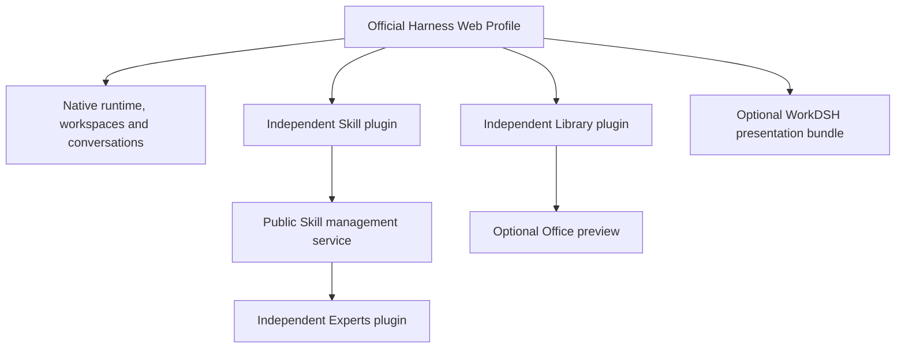

<p align="center"></p>
<h1 align="center">WorkDSH</h1>
<p align="center"><strong>Give AI a job. Watch it work. Open the result.</strong></p>
<p align="center">An open-source, WorkBuddy-inspired AI workspace for NexusOne.</p>
<p align="center"><strong>English</strong> · <a href="README.zh-CN.md">简体中文</a></p>
<p align="center">
  <a href="https://github.com/techflag/workdsh/releases">Download</a> ·
  <a href="https://gitee.com/techflag/workdsh">Gitee mirror</a> ·
  <a href="#quick-start">Quick start</a> ·
  <a href="#see-the-work-not-just-the-answer">Screenshots</a> ·
  <a href="docs/ROADMAP.md">Roadmap</a> ·
  <a href="https://techflag.github.io/workdsh/">Website</a>
</p>

WorkDSH adds a **local Library, skills, experts, connectors, team activity, browser/computer use, and editable Office deliverables** to the native NexusOne task experience. You stay in one conversation while the work appears beside it as a real document, spreadsheet, presentation, PDF, webpage, or connected-service result.

Think of it as an **independent open-source alternative for a WorkBuddy-style workflow**: assign a real job, watch the work unfold, intervene when needed, and receive editable artifacts. WorkDSH is built independently for NexusOne and is not an official WorkBuddy release.


*Real local preview: the conversation, delivered files, and an editable HTML dashboard remain in the same task. Example data and costs belong to the user's test workspace.*

## Start with one real task

Attach your material and ask in plain language:

> Review this budget workbook. Flag every missing assumption, show the findings in a dashboard, and deliver the HTML file.

WorkDSH can keep the source material, model conversation, live result, revisions, and final file together. You can inspect the work, edit it yourself, then ask the AI to continue from the latest saved version.

Already using the Harness `0.1.6-alpha.2` Web Profile? Install the modules you need from [Releases](https://github.com/techflag/workdsh/releases), or jump to the [quick start](#quick-start). WorkDSH uses the official `dsh plugin` lifecycle rather than a second runtime.

## What it gives you

| You need | WorkDSH behavior | Result |
| --- | --- | --- |
| A report, brief, or dashboard | Reads the task material, writes in visible batches, and keeps revisions | Editable HTML, Word, PDF, or Markdown working copy within the supported format scope |
| A presentation | Creates or imports a PPTX working copy, edits slides, and keeps human changes | Editable PPTX with download; complex-template fidelity still requires review |
| A spreadsheet | Opens a workbook beside the task and preserves supported values and formulas | Editable XLSX working copy with format-specific limits |
| Knowledge capture and reuse | Stores Markdown, text, HTML, PDF, Word, and PPT files locally; browses folders, searches full text, and previews originals | A reusable personal Library whose selected revisions can be sent directly into a new conversation |
| Repeatable expertise | Installs or creates Markdown skills with resources; experts pin reviewed revisions | Reusable skills and explicit expert identities instead of one-off prompts |
| Connected services | Adds independent MCP instances, keeps credentials in the official credential service, and selects tools per conversation | A visible connector name beside the prompt and only that connector's MCP namespace in the task |
| Team execution | Shows the team, members, active state, and task activity in the conversation | A visible collaboration trail; complete TM-01 real-model acceptance is still in progress |

## See the work, not just the answer

<table>
<tr>
<td width="50%"><br><strong>Live PPT work</strong><br>Review the reasoning and edit slides in the same task.</td>
<td width="50%"><br><strong>Skills as managed capabilities</strong><br>Discover, inspect, install, edit, disable, and recover skills.</td>
</tr>
<tr>
<td colspan="2"><br><strong>Native Agent Team and live WorkDSH status stay visible together</strong><br>The native panel owns members, shared tasks, dependencies, and navigation. The Siri-style strip keeps the current team state visible and animates its colored edge while work is running.</td>
</tr>
<tr>
<td colspan="2"><br><strong>Real browser action, evidence, then human control</strong><br>In this real WorkDSH task, the agent searched JD, added the selected product to the cart, presented the result and screenshot together, and stopped before checkout.</td>
</tr>
<tr>
<td width="50%"><br><strong>Connect one service to one conversation</strong><br>Tencent Docs is selected only for this task, its name stays visible beside the prompt, and the answer comes from real MCP tool calls.</td>
<td width="50%"><br><strong>Real MCP lifecycle and discovery</strong><br>The official Harness MCP client connected to Tencent Docs and discovered 224 tools; the token stays in the official credential service.</td>
</tr>
</table>

## Local Library 0.1


The Library turns task outputs and reference files into local knowledge that can be searched, previewed, and supplied to the model again. It supports folders, recent items, and full-text search; retains original files; and produces deterministic text for Markdown, TXT, HTML, PDF, DOCX, and PPTX content.

- Selecting a file or folder creates a **fixed-revision** reference in a new conversation, so later edits cannot silently change content already sent to the model.
- Enter `/skill-name` in that conversation to combine a Skill's method with the selected Library material; this composition path is covered by an integration test.
- HTML and Markdown preview directly. With the Office plugin installed, Word and PPT also receive enhanced original-file previews.
- The current Alpha targets one local user, with move, rename, delete, disabled restore, and a 5 GiB aggregate revision quota. Scanned-PDF OCR and shared team libraries are not included yet.

[Download the Library Alpha](https://github.com/techflag/workdsh/releases/tag/library-v0.1.0-alpha.1) · [Read the Library package guide](packages/plugins/library/README.md)

## What makes WorkDSH different

| Characteristic | What you experience |
| --- | --- |
| **Open-source WorkBuddy-style workflow** | The task, visible process, human checkpoints, and editable result stay together in an implementation you can inspect, install, and extend. |
| **Real deliverables** | Supported outputs are saved as working copies and downloadable files. A failed tool call is never presented as a finished file. |
| **Live human–AI editing** | Open a result, correct it directly, and let the model continue from the latest saved revision. |
| **Reusable local knowledge** | Keep files in folders, search their text, preview originals, and bring fixed revisions into a new conversation together with a Skill. |
| **Reusable professional capability** | Skills carry instructions and resources; experts bind reviewed skill revisions and an explicit identity instead of relying on a one-off role prompt. |
| **Conversation-scoped connectors** | Enable multiple MCP instances globally, then choose exactly which connected service a conversation may use. A new conversation starts with none selected. |
| **Visible team activity** | The conversation can show the expert team, active member, handoff, and task state. Full TM-01 real-model acceptance remains in progress. |
| **Native Harness workflow** | Tasks, models, attachments, permissions, queues, skills, and plugin loading remain owned by Harness; WorkDSH extends public services and UI slots. |
| **Independent plugin delivery** | Skills, experts, Office, activity, governance, and presentation are versioned separately, so a Profile installs only what it needs. |

## Current preview status

The latest public Web preview was verified on **Harness `0.1.6-alpha.2`, Node.js `22.23.2`, and macOS** through packaged installation and cold-start checks. The local Library, Skills, individual experts, MCP connectors, Office working copies, browser/computer use, and collaboration activity are available as alpha modules.

This remains a development preview. Real-model acceptance for complete expert-team workflows, arbitrary Office fidelity, and multi-platform behavior is not finished. The default listener is local; this repository does not claim a production-ready internet-facing multi-tenant deployment. Exact versions, checksums, limits, and evidence are documented below.

## Plugins are the architecture

WorkDSH follows Harness's own extension model: official **Loader + Profile + Cordis**, standard Host/Client entry points, and documented UI Slots. It uses published Harness packages and requires no upstream source checkout.

| Principle | What it means |
| --- | --- |
| Install capabilities independently | Skill ships its own configuration layer, Host service, Client module, and prebuilt `.tgz`. The presentation package is optional. |
| Compose through public contracts | Experts reference shared Skills; Library fixed references enter native conversations and can use Office's enhanced preview service. |
| Keep the native runtime | Harness owns conversations, workspaces, model execution, skill discovery and invocation, and plugin loading. WorkDSH contributes management workflows and UI. |
| Version each module separately | Skill stays on its own `0.1` line. A presentation update does not force a Skill version change. |
| Preserve user content | Removing the Skill **plugin** preserves skill files and management data. Uninstalling an individual **skill** uses the recoverable management workflow. |



A **feature plugin** is an installable software module. A **skill** is a user-managed `SKILL.md` with optional resources. One Skill plugin manages many skills; creating a skill does not require publishing an npm package.

## What Skill 0.1 can do

| Workflow | Available behavior |
| --- | --- |
| Browse | Global local-skill list, search, full `SKILL.md`, resource files, and invalid-skill diagnostics. |
| Create and try | Prepare a native task with `/skill-creator` or `/skill-name`; keep attachments, `/`, `@`, model selection, permissions, and sending. |
| Import | `.zip`, `.md`, or folders; inspect files, validate format and paths, confirm scope, then install atomically. Import does not execute included scripts. |
| Edit | Edit documents and text resources, detect revision conflicts, save, and rediscover. Directory reveal uses the native Host capability. |
| Manage | Enable/disable, check registered dependency impact, batch operations, recoverable uninstall, and restore. |
| Recover | Preserve edits and management state across tested cold restarts; cancel uploads and retry failed imports. |

<details>
<summary><strong>Skill details and standalone installation</strong></summary>


Standalone installation retains Harness branding and native navigation. The optional presentation bundle adds WorkDSH branding and its dark theme.

</details>

## Download by module

Each installable module has a matching **GitHub prerelease, versioned package, SHA-256 checksums, and release manifest**. These are prebuilt artifacts; npm registry publication has not been performed.

| Module | Package version | Download | Scope |
| --- | --- | --- | --- |
| Library | `workdsh-plugin-library@0.1.0-alpha.1` | [Library `.tgz`](https://github.com/techflag/workdsh/releases/download/library-v0.1.0-alpha.1/workdsh-plugin-library-0.1.0-alpha.1.tgz) · [Release](https://github.com/techflag/workdsh/releases/tag/library-v0.1.0-alpha.1) | Local folders, full-text search, original previews, fixed revisions, and new-conversation context. |
| Skill management | `workdsh-plugin-skills@0.1.0-alpha.30` | [Skill `.tgz`](https://github.com/techflag/workdsh/releases/download/v0.1.0-alpha.6/workdsh-plugin-skills-0.1.0-alpha.30.tgz) · [Project release](https://github.com/techflag/workdsh/releases/tag/v0.1.0-alpha.6) | Independently installable feature plugin. |
| Experts | `workdsh-plugin-experts@0.1.0-alpha.5` | [Expert `.tgz`](https://github.com/techflag/workdsh/releases/download/v0.1.0-alpha.6/workdsh-plugin-experts-0.1.0-alpha.5.tgz) · [Release](https://github.com/techflag/workdsh/releases/tag/v0.1.0-alpha.6) | Expert definitions and reviewed revisions composed with the official DSH Team runtime. |
| Connectors | `workdsh-plugin-connectors@0.1.0-alpha.1` | [Connector `.tgz`](https://github.com/techflag/workdsh/releases/download/v0.1.0-alpha.6/workdsh-plugin-connectors-0.1.0-alpha.1.tgz) · [Project release](https://github.com/techflag/workdsh/releases/tag/v0.1.0-alpha.6) | Multiple stdio/HTTP MCP instances, official credential storage, health/tool discovery, and per-conversation tool isolation. |
| Activity | `workdsh-plugin-activity@0.1.0-alpha.4` | [Activity `.tgz`](https://github.com/techflag/workdsh/releases/download/v0.1.0-alpha.6/workdsh-plugin-activity-0.1.0-alpha.4.tgz) · [Release](https://github.com/techflag/workdsh/releases/tag/v0.1.0-alpha.6) | Visible task, skill, and expert-team activity. |
| Office | `workdsh-plugin-office@0.1.0-alpha.7` | [Office `.tgz`](https://github.com/techflag/workdsh/releases/download/v0.1.0-alpha.6/workdsh-plugin-office-0.1.0-alpha.7.tgz) · [Release](https://github.com/techflag/workdsh/releases/tag/v0.1.0-alpha.6) | Supported editable working copies, previews, and file export. |
| WorkDSH presentation | `workdsh-bundle@0.1.0-alpha.46` | [Presentation `.tgz`](https://github.com/techflag/workdsh/releases/download/v0.1.0-alpha.6/workdsh-bundle-0.1.0-alpha.46.tgz) · [Project release](https://github.com/techflag/workdsh/releases/tag/v0.1.0-alpha.6) | Optional brand, theme, and workbench composition. Install feature plugins separately. |

Workbench `alpha.10` is currently delivered within the presentation bundle. Shared UI, contracts, and the local identity/access/audit foundation are supporting packages, **not standalone end-user downloads**. See the [complete module map](docs/RELEASES.md).

## Quick start

### Install a prebuilt plugin

Use **Node.js 22.19+ on the 22 LTS line, or Node 24+**, **pnpm 10.34.5**, and the official **Harness CLI `0.1.6-alpha.2`**. These commands assume `dsh` resolves to that CLI, rather than an older desktop launcher.

For the complete product, download every asset from [project release `v0.1.0-alpha.6`](https://github.com/techflag/workdsh/releases/tag/v0.1.0-alpha.6) into one directory. The Library is currently a separate prerelease, so also download the [Library Alpha package](https://github.com/techflag/workdsh/releases/tag/library-v0.1.0-alpha.1). Stop the target profile, `cd` to that directory, install the project bundle, then add the Library package separately:

```sh
node install-workdsh.mjs --profile workdsh
dsh --profile workdsh
```

Use `--dry-run` to inspect the commands. The equivalent manual installation is:

```sh
dsh --profile workdsh --from-default-profile web --dump-config
dsh plugin --profile workdsh add "$PWD/workdsh-provider-identity-local-0.1.0-alpha.5.tgz"
dsh plugin --profile workdsh add "$PWD/workdsh-plugin-audit-0.1.0-alpha.4.tgz"
dsh plugin --profile workdsh add "$PWD/workdsh-plugin-access-0.1.0-alpha.5.tgz"
dsh plugin --profile workdsh add "$PWD/workdsh-plugin-library-0.1.0-alpha.1.tgz"
dsh plugin --profile workdsh add "$PWD/workdsh-plugin-skills-0.1.0-alpha.30.tgz"
dsh plugin --profile workdsh add "$PWD/workdsh-plugin-experts-0.1.0-alpha.5.tgz"
dsh plugin --profile workdsh add "$PWD/workdsh-plugin-connectors-0.1.0-alpha.1.tgz"
dsh plugin --profile workdsh add "$PWD/workdsh-plugin-activity-0.1.0-alpha.4.tgz"
dsh plugin --profile workdsh add "$PWD/workdsh-plugin-office-0.1.0-alpha.7.tgz"
dsh plugin --profile workdsh add "$PWD/workdsh-bundle-0.1.0-alpha.46.tgz"
dsh --profile workdsh
```

Verify the downloads against `SHA256SUMS` first. `workdsh-plugin-experts` composes the official Harness Agent Team Host, nine Team tools, and Client panel; after installation, **Agent Team** appears in the conversation header. Installing only Skills and the presentation bundle does not install Experts, Team, Connectors, or Office.

Open **专家 · 技能 · 连接器** in the sidebar to manage experts, skills, and connectors. Model-backed execution requires your own Harness model configuration.

Follow the official [`dsh plugin … add` flow](https://deepseek-harness.github.io/deepseek-harness/develop/basic/publish). GitHub's **Source code** archives are source snapshots; install the named `.tgz` assets. Installation and removal are verified with the Host stopped and restarted, not as complete live CLI hot-unload operations.

### Run from the repository

```sh
git clone https://github.com/techflag/workdsh.git
cd workdsh
corepack pnpm install --frozen-lockfile
corepack pnpm build
corepack pnpm preview:install
corepack pnpm preview
```

The preview runs at `http://127.0.0.1:18989`; use the authenticated URL printed at startup. It has its own Profile and reads your normal `~/.agents` skills by default. Automated tests use isolated homes. See [development setup](docs/DEVELOPMENT.md).

## Roadmap

| Stage | Scope | Status |
| --- | --- | --- |
| Skill 0.1 | Local skill management and independent package delivery | Available on the verified Web baseline. |
| Experts 0.1 | Definitions, drafts, revisions, shared skill references, and task handoff | Alpha available; professional quality and final stability acceptance incomplete. |
| Office 0.1 | Real-file creation, live editing, preview, and export; PPT is the current source-development focus | Alpha available; PPT template and real-model visual acceptance remain in progress. Word feature expansion is paused. |
| Connectors 0.1 | Multiple MCP instances, official credential storage, discovery, lifecycle, and per-conversation selection | Alpha available; token authorization is verified, while interactive OAuth remains future work. |
| Library 0.1 | Local knowledge space, folders, full-text search, original preview, and fixed conversation revisions | Alpha released; the local personal workflow is available, while sharing and OCR remain future work. |
| Following modules | Projects → industry applications → integration | Planned, delivered one module at a time. |
| Enterprise | Server + administration Web + Harness execution nodes; organization skills, categories, versions, access, and rollout | Deferred. No public Skill marketplace, SkillHub, or skill suites in this release. |

See the [roadmap](docs/ROADMAP.md), [expert handoff](docs/design/experts/README.md), and [enterprise ToDo](docs/TODO.md). This preview targets a trusted local user; it is not an internet-facing multi-tenant server.

## Development and documentation

```sh
corepack pnpm typecheck
corepack pnpm test:integration
corepack pnpm test:planning
corepack pnpm check:plan
corepack pnpm check:versions
corepack pnpm probe:skills
corepack pnpm probe:browser
```

Packaged probes exercise actual installation, browser interactions, edits, recovery, removal, and reinstallation. They do not prove real-model quality, enterprise isolation, or compatibility with untested desktop versions.

| Documentation | Purpose |
| --- | --- |
| [Architecture](docs/ARCHITECTURE.md) · [Plugin composition ADR](docs/adr/0018-composable-feature-plugins-and-shared-skills.md) | Ownership, composition, and public plugin boundaries. |
| [Official development rules](docs/HARNESS-OFFICIAL-DEVELOPMENT.md) · [Repository rules](AGENTS.md) | Official contracts first; no parallel runtime or upstream modifications. |
| [Module releases](docs/RELEASES.md) · [Library package guide](packages/plugins/library/README.md) · [Skill package guide](packages/plugins/skills/README.md) | Artifacts, version mapping, installation, and limitations. |
| [Verification evidence](docs/evidence/skills-standalone-package.md) · [Status](docs/STATUS.md) | Actual results and remaining work. |
| [UI specification](docs/UI-DESIGN.md) · [Brand assets](docs/BRAND.md) | Shared components and visual direction. |

Feature modules live in `packages/plugins/<domain>`, providers in `packages/providers/<name>`, and shared packages in `packages/{contracts,ui,bundle}`. Scaffolds do not imply installable plugins. See the [package guide](packages/plugins/README.md).

Built on [NexusOne](https://deepseek-harness.github.io/deepseek-harness/); interaction references include [WorkBuddy](https://www.workbuddy.cn/). WorkDSH is an independent project, not an official product of either team.

## Current development preview


User-provided screenshot of the current application, showing categories, search, installed-skill management and installation from a local catalog. Third-party skill names and icons belong to their respective providers; they do not demonstrate completed connector integrations. Task names and spending figures are local user state, not bundled defaults.

The current Office development candidate keeps `pptx-react-viewer` as its sole PPT editor, integrated with the native results panel and shared Office content service. It supports incremental slide writing, human editing, native chart data, saved working copies and PPTX download. Chinese UI, template fidelity, and real-model visual quality are still being improved. See [PPT integration evidence](docs/evidence/office-pptx-integration.md).

### HTML and PDF working copies

The current source candidate can open a self-contained HTML page in the native results panel before AI updates its saved revisions. PDF creation supports Chinese text, page updates, preview, manual text changes and actual PDF download/file delivery. PDF rendering uses bundled libraries and an embedded font; end users do not need Python for this PDF workflow. Existing arbitrary PDF import, OCR and image editing are not supported. These additions are source-development features and do not change the older Word-only release archives.

See [HTML working copies](docs/design/office/HTML-LIVE.md) and [PDF working copies](docs/design/office/PDF-LIVE.md) for implementation scope and acceptance boundaries.

#### HTML dashboard generation


Generate a self-contained HTML dashboard from task materials, preview the finished page in the native results panel, and receive the HTML files through native deliverable cards. This user-provided screenshot shows a budget dashboard with parameter cards, section navigation and missing-information notices, alongside the delivered dashboard and `index.html` files. It shows local file preview; conversation names, paths and figures belong to this example.

Public expert creation is reusable across domains, with methods, real Skill selection, explicit UI publication and native task trials. Model-generated content still needs user review; synthetic professional evaluations document limitations rather than guaranteeing every answer. See [current evidence](docs/evidence/d04-experts-review-fixes.md).

### Native PPT editing preview

[Office alpha.7 project release and installable archive](https://github.com/techflag/workdsh/releases/tag/v0.1.0-alpha.6)


User-provided application screenshot showing incremental AI slide editing in the native results panel. This existing conversation still contains earlier export guidance; the new PPTX content_export implementation is described in the source and has not yet passed a real-session file-card acceptance test.

[2026-09-14 development-candidate notes](docs/releases/2026-09-14-development-candidate.md)

### Activity and expert teams


A compact activity strip shows the native task state and the current skill, alongside the original conversation and live HTML working copy. Its colored border animates while processing; animations can be disabled and respect reduced-motion preferences. The strip is centered and uses half the available width on wide screens.


Expert-team sessions carry the team name and activity state. Member activity appears when native child sessions exist; the team label alone does not prove multiple members are executing. This example shows zero child agents at the captured moment.


Team details show capabilities, starter requests, the lead and members. Saved drafts remain separate from published revisions; summoning uses the published revision until changes are explicitly published. These are user-provided local preview screenshots, including example task names, paths and spending figures; they document the development candidate rather than the older downloadable releases.

## Open-source components and acknowledgements

Thank you to these projects and their maintainers. This list covers major direct dependencies; package manifests, the lockfile and generated license inventories describe the full dependency set.

| Project | Use in WorkDSH | License |
| --- | --- | --- |
| [NexusOne](https://github.com/deepseek-ai/deepseek-harness) / Cordis | Native tasks, model execution, skills, Loader, Profile, services and UI extension APIs | MIT |
| [React](https://github.com/facebook/react) | Feature pages and editor UI | MIT |
| [Tiptap](https://github.com/ueberdosis/tiptap) / [ProseMirror](https://github.com/ProseMirror) | Word working-copy editing, tables and images; adapted open-source Tiptap UI components | MIT |
| [pptx-viewer](https://github.com/ChristopherVR/pptx-viewer) | `pptx-react-viewer` 3.16.5 and `pptx-viewer-core` 3.14.3: the sole current PPT editing, parsing and export implementation | Apache-2.0 |
| [docx](https://github.com/dolanmiu/docx) | DOCX generation within the supported scope | MIT |
| [docx-preview](https://github.com/VolodymyrBaydalka/docxjs) | Original-layout DOCX preview | Apache-2.0 |
| [Univer OSS](https://github.com/dream-num/univer) / [ExcelJS](https://github.com/exceljs/exceljs) | Existing experimental spreadsheet adapters in development builds; full online spreadsheets remain planned | Apache-2.0 / MIT |
| [PDF.js](https://github.com/mozilla/pdf.js) | Decode and display generated PDF files with a bundled worker | Apache-2.0 |
| [pdf-lib](https://github.com/Hopding/pdf-lib) / [fontkit](https://github.com/Hopding/fontkit) | Encode PDF working copies and embed Chinese glyphs | MIT |
| [Noto Sans SC](https://github.com/google/fonts/tree/main/ofl/notosanssc) | Bundled static Chinese font; license and derivation metadata retained | SIL Open Font License 1.1 |
| [i18next](https://github.com/i18next/i18next) / [react-i18next](https://github.com/i18next/react-i18next) | Chinese localization for the PPT editor | MIT |
| [Lucide](https://github.com/lucide-icons/lucide) | PPT toolbar icons | ISC |
| [dsh-cost-meter](https://github.com/Han-1413141/dsh-cost-meter) | Separately installed spending plugin in the local preview Profile; not bundled in WorkDSH releases | See the independent project's license |

WorkDSH explicitly takes **WorkBuddy / CodeBuddy** as a product-experience reference: a real task should expose its process and end in an editable artifact. Skill-market organization, grouped toolbars, and PPT design guidance also draw on those experiences. WorkDSH is an independent open-source implementation for NexusOne; it does not reuse WorkBuddy branding or claim an official partnership, endorsement, or Tencent PPT engine integration.

Third-party skills and materials retain their providers' terms. Generated archives retain copyright and license texts for dependencies actually bundled; see [Office third-party notices](packages/plugins/office/THIRD-PARTY-NOTICES.md).

### Additional bundled Office dependencies / Office 其他打包依赖

The current build inventory additionally includes the following package versions. Licenses below are the declarations in the installed package metadata. Existing bundled notices are retained.

当前构建另包含下列依赖版本；许可证栏记录安装包元数据的声明，来源链接指向对应项目。完整199项打包依赖见[Office依赖清单](docs/evidence/office-bundled-dependencies-2026-09-14.md)。

下表 10 项是“已声明许可证、但构建未收集到随包文本”的精确报告。此外，`@univerjs/telemetry@0.25.1` 的安装包元数据没有许可证字段，发布清单单独记录为 `dependenciesWithoutDeclaredLicense`。两类缺项均未伪装为许可证收集完成。

| Dependency / 依赖 | Version / 版本 | Declared license / 声明许可证 |
| --- | --- | --- |
| [@ai-sdk/provider-utils](https://github.com/vercel/ai) | 5.0.0 | Apache-2.0 |
| [@ai-sdk/provider-utils](https://github.com/vercel/ai) | 5.0.28 | Apache-2.0 |
| [@nodable/entities](https://github.com/nodable/val-parsers) | 3.0.0 | MIT |
| [@pdf-lib/fontkit](https://github.com/Hopding/fontkit) | 1.1.1 | MIT |
| [franc-min](https://github.com/wooorm/franc/tree/main/packages/franc-min) | 6.2.0 | MIT |
| [ot-json1](https://github.com/josephg/json1) | 1.0.2 | ISC |
| [ot-text-unicode](https://github.com/ottypes/text) | 4.0.0 | ISC |
| [pptx-viewer-mcp](https://github.com/ChristopherVR/pptx-viewer) | 2.5.1 | Apache-2.0 |
| [react-remove-scroll-bar](https://github.com/theKashey/react-remove-scroll-bar) | 2.3.8 | MIT |
| [unicount](https://github.com/josephg/unicount) | 1.1.0 | ISC |

## 2026-09-19 Project alpha release / 项目级预览发行

本批通过九个精确安装包的隔离官方 Web Profile 安装、匿名 401 / 认证 200 边界检查、Host 冷启动与全部模块移除后冷启动。完整构建、110 项集成测试、14 项活动测试、2 项规划测试通过。验证环境：Harness 0.1.6-alpha.2，Node 22.23.2，macOS。小时级专家团稳定性、任意 Office 保真及多平台整体验收尚未完成。

| 模块 | 安装包版本 | 下载 |
| --- | --- | --- |
| experts | `workdsh-plugin-experts@0.1.0-alpha.5` | [Release](https://github.com/techflag/workdsh/releases/tag/v0.1.0-alpha.6) · [tgz](https://github.com/techflag/workdsh/releases/download/v0.1.0-alpha.6/workdsh-plugin-experts-0.1.0-alpha.5.tgz) |
| skills | `workdsh-plugin-skills@0.1.0-alpha.30` | [Release](https://github.com/techflag/workdsh/releases/tag/v0.1.0-alpha.6) · [tgz](https://github.com/techflag/workdsh/releases/download/v0.1.0-alpha.6/workdsh-plugin-skills-0.1.0-alpha.30.tgz) |
| connectors | `workdsh-plugin-connectors@0.1.0-alpha.1` | [Project release](https://github.com/techflag/workdsh/releases/tag/v0.1.0-alpha.6) · [tgz](https://github.com/techflag/workdsh/releases/download/v0.1.0-alpha.6/workdsh-plugin-connectors-0.1.0-alpha.1.tgz) |
| activity | `workdsh-plugin-activity@0.1.0-alpha.4` | [Release](https://github.com/techflag/workdsh/releases/tag/v0.1.0-alpha.6) · [tgz](https://github.com/techflag/workdsh/releases/download/v0.1.0-alpha.6/workdsh-plugin-activity-0.1.0-alpha.4.tgz) |
| office | `workdsh-plugin-office@0.1.0-alpha.7` | [Release](https://github.com/techflag/workdsh/releases/tag/v0.1.0-alpha.6) · [tgz](https://github.com/techflag/workdsh/releases/download/v0.1.0-alpha.6/workdsh-plugin-office-0.1.0-alpha.7.tgz) |
| bundle | `workdsh-bundle@0.1.0-alpha.46` | [Project release](https://github.com/techflag/workdsh/releases/tag/v0.1.0-alpha.6) · [tgz](https://github.com/techflag/workdsh/releases/download/v0.1.0-alpha.6/workdsh-bundle-0.1.0-alpha.46.tgz) |

下载所需tgz后，使用官方CLI：`dsh plugin --profile <profile> add /absolute/path/<package>.tgz`。基础身份、审计与授权配套见专家发行附件；各模块独立安装。仅发布GitHub alpha附件，未发布npm注册表。Office依赖引用与声明许可证见下文；现有notice及检查报告保留。
