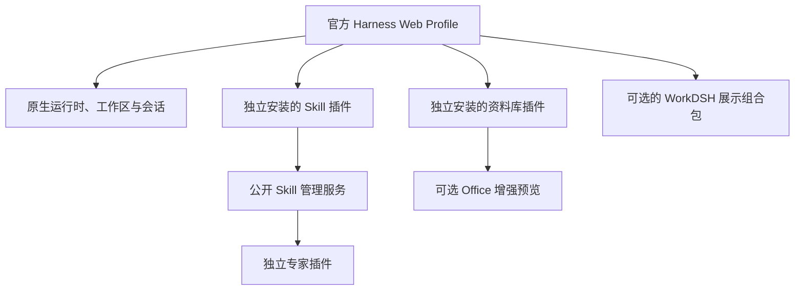

<p align="center"></p>
<h1 align="center">WorkDSH</h1>
<p align="center"><strong>交给 AI 一项工作，看着它完成，打开真正的成果。</strong></p>
<p align="center">面向 NexusOne、开源实现 WorkBuddy 式体验的 AI 工作台。</p>
<p align="center"><a href="README.md">English</a> · <strong>简体中文</strong></p>
<p align="center">
  <a href="https://github.com/techflag/workdsh/releases">下载安装包</a> ·
  <a href="https://gitee.com/techflag/workdsh">Gitee 国内镜像</a> ·
  <a href="#快速开始">三分钟上手</a> ·
  <a href="#看到工作过程也拿到真实成果">产品截图</a> ·
  <a href="docs/ROADMAP.md">开发路线</a> ·
  <a href="https://techflag.github.io/workdsh/">产品网站</a>
</p>

WorkDSH 把**本地资料库、技能、专家、连接器、团队动态、浏览器/电脑操作和可编辑的 Office 成果**装进 NexusOne 原生任务体验。你不用在聊天、临时网页和本地文件之间来回切换：对话在左边继续，文档、表格、PPT、PDF、网页或外部服务结果在右边实时出现，最后留下可以打开和下载的成果。

你可以把它理解为一个**独立开源的 WorkBuddy 式工作台**：交代真实任务，看到执行过程，需要时人工介入，最后拿到可继续编辑的成果。WorkDSH 针对 NexusOne 独立开发，并非 WorkBuddy 官方开源版本。


*真实本地预览：同一个任务中保留对话、交付文件和可打开的 HTML 看板。截图中的示例数据、任务名称与费用来自用户测试工作区。*

## 先用一个真实任务试它

把材料拖进来，直接说：

> 检查这份预算表，把所有缺失的假设标出来，做成一个数据看板，并交付 HTML 文件。

WorkDSH 会把参考材料、模型过程、实时成果、人工修改和最终文件放在同一个任务里。你可以边看边改，也可以让 AI 读取最新保存版本后继续，不必从旧提示词重新生成。

已经使用 Harness `0.1.6-alpha.2` Web Profile？从 [Releases](https://github.com/techflag/workdsh/releases) 下载需要的模块，或直接看[快速开始](#快速开始)。WorkDSH 使用官方 `dsh plugin` 生命周期，没有另造第二套运行时。

## 它能替你交付什么

| 你的需求 | WorkDSH 怎么做 | 你拿到什么 |
| --- | --- | --- |
| 报告、简报或数据看板 | 读取任务材料，分批写入，在右侧持续显示并保存修订 | 支持范围内可编辑的 HTML、Word、PDF 或 Markdown 工作副本 |
| 汇报 PPT | 新建或导入 PPTX 工作副本，逐页修改，保留人工调整 | 可编辑、可下载的 PPTX；复杂模板仍需逐页复核 |
| 数据表格 | 在任务旁打开工作簿，保留已支持的值和公式 | 可编辑的 XLSX 工作副本及明确的格式边界 |
| 资料沉淀与复用 | 把 Markdown、文本、HTML、PDF、Word 和 PPT 存进本地资料库，按目录或全文搜索并预览原件 | 可持续复用的个人资料空间；选定修订可直接带入新对话供模型读取 |
| 可复用的专业能力 | 安装或创建带资源的 Markdown 技能；专家固定审阅后的技能版本 | 可管理的技能和明确的专家身份，不再依赖一次性提示词 |
| 外部服务 | 管理多个 MCP 实例，凭据进入官方凭据服务，并按对话选择工具 | 输入框旁显示连接器名称，本次任务只获得所选连接器的 MCP 工具 |
| 团队协作 | 在会话里显示专家团、成员、当前状态和任务动态 | 可见的协作轨迹；TM-01 真实模型完整验收仍在进行 |

## 看到工作过程，也拿到真实成果

<table>
<tr>
<td width="50%"><br><strong>PPT 在任务旁生成和修改</strong><br>左边核对过程，右边直接编辑幻灯片。</td>
<td width="50%"><br><strong>技能是可以管理的能力</strong><br>发现、查看、安装、编辑、停用和恢复技能。</td>
</tr>
<tr>
<td colspan="2"><br><strong>官方 Agent Team 与 WorkDSH 实时状态同时可见</strong><br>原生面板负责成员、共享任务、依赖关系和会话跳转；Siri 风格活动条继续显示团队当前状态，并在处理任务时启用彩色环绕动效。</td>
</tr>
<tr>
<td colspan="2"><br><strong>真实网页操作、可核对证据、关键步骤由人接管</strong><br>这次真实任务里，WorkDSH 搜索京东、把用户选定的商品加入购物车，将执行结果和截图放在一起，并停在结算之前。</td>
</tr>
<tr>
<td width="50%"><br><strong>一个对话只连接需要的服务</strong><br>腾讯文档只用于当前任务，名称持续显示在输入框旁，回答来自真实 MCP 工具调用。</td>
<td width="50%"><br><strong>真实 MCP 生命周期与工具发现</strong><br>Harness 官方 MCP Client 已连接腾讯文档并发现 224 个工具；令牌保存在官方凭据服务中。</td>
</tr>
</table>

## 本地资料库 0.1


资料库把任务产物和常用材料沉淀为可搜索、可预览、可再次交给模型使用的本地知识空间。它支持目录、最近使用和全文搜索，保留原始文件，并为 Markdown、TXT、HTML、PDF、DOCX 和 PPTX 生成稳定的文本内容，供检索和模型上下文使用。

- 从资料库选择文件或文件夹后，会以**固定修订**加入一个新对话，避免后续编辑悄悄改变已经发送给模型的内容。
- 在同一个对话中输入 `/技能名`，可以同时使用 Skill 的方法和资料库中的材料；这条组合链路已有集成测试覆盖。
- HTML 和 Markdown 可直接预览；安装 Office 插件后，Word 和 PPT 还能使用增强原件预览。
- 当前 Alpha 面向本机个人资料，提供移动、重命名、删除、禁用恢复和 5 GiB 修订总配额；扫描 PDF OCR 和团队共享资料库尚未提供。

[下载资料库 Alpha](https://github.com/techflag/workdsh/releases/tag/library-v0.1.0-alpha.1) · [查看资料库包说明](packages/plugins/library/README.md)

## WorkDSH 的核心特色

| 特色 | 你实际感受到的变化 |
| --- | --- |
| **开源的 WorkBuddy 式工作流** | 任务、可见过程、人工检查点和可编辑成果留在一起，代码可以审阅、安装和扩展。 |
| **交付真实成果** | 已支持的输出会保存为工作副本和可下载文件；工具失败时不会把一段文字冒充已交付文件。 |
| **人与 AI 实时共编** | 打开成果直接修正，再让模型从最新保存版本继续，不必根据旧提示词全部重做。 |
| **本地资料可持续复用** | 文件按目录保存和全文检索，原件可预览，选定修订可带入新对话并与 Skill 一起使用。 |
| **专业能力可以复用** | 技能携带指令和资源，专家绑定经过审阅的技能修订与明确身份，不依赖一次性的角色提示词。 |
| **连接器按对话生效** | 全局启用多个 MCP 实例，再决定当前对话能使用哪一个；新会话默认不选择连接器。 |
| **团队作战过程可见** | 会话中可以看到专家团、当前成员、交接和任务状态；TM-01 真实模型完整验收仍在进行。 |
| **保留 Harness 原生体验** | 任务、模型、附件、权限、队列、技能和插件加载仍由 Harness 负责，WorkDSH 扩展公开服务和 UI 插槽。 |
| **插件独立交付** | 技能、专家、Office、活动、治理和展示分别版本化，Profile 只安装真正需要的模块。 |

## 当前预览状态

最新公开 Web 预览已在 **Harness `0.1.6-alpha.2`、Node.js `22.23.2`、macOS** 上完成真实安装包与冷启动验证。本地资料库、技能管理、已发布专家、MCP 连接器、官方 Team 协作、浏览器/电脑操作、Office 工作副本和协作动态均已有 alpha 模块。

它仍是开发预览：专家团完整真实模型流程、任意复杂 Office 文件保真和多平台验收尚未完成；默认只监听本机，也不宣称已经具备可直接暴露公网的生产级多租户能力。下文保留精确版本、校验值、能力边界和验证证据。

## 插件就是架构

WorkDSH 遵循 Harness 自身的扩展方式：官方 **Loader + Profile + Cordis**、标准 Host/Client 入口和公开 UI Slot。工程只使用已发布的 Harness 包，不需要检出上游源码。

| 特色 | 实际含义 |
| --- | --- |
| 按需安装能力 | Skill 自带配置层、Host 服务、Client 模块和预构建 `.tgz`，展示包可选。 |
| 通过公开契约互通 | 插件经服务注入协作。专家引用共享技能；资料库通过固定引用进入原生对话，并可调用 Office 的增强预览。 |
| 保留原生运行底座 | 会话、工作区、模型执行、技能发现与调用、插件加载由 Harness 拥有；WorkDSH 补充管理流程和界面。 |
| 每个模块独立版本 | Skill 使用自己的 `0.1` 版本线，展示包更新不强制技能模块同步升级。 |
| 保留用户内容 | 移除技能管理**插件**会保留技能文件和管理数据；卸载某一个**技能对象**则进入可恢复流程。 |



**功能插件**是可安装的软件模块；**技能**是用户管理的 `SKILL.md` 及其资源。一个技能管理插件管理多个技能，制作技能不需要发布 npm 包。

## Skill 0.1 可以做什么

| 流程 | 已有能力 |
| --- | --- |
| 浏览 | 全局本地技能列表、搜索、完整 `SKILL.md`、资源文件，以及无效技能诊断。 |
| 创建与试用 | 将 `/skill-creator` 或 `/技能名` 交给原生任务框，保留附件、`/`、`@`、模型、权限和发送流程。 |
| 导入 | 选择 `.zip`、`.md` 或文件夹；预览文件、校验格式与路径、确认范围，再原子安装。导入不运行包内脚本。 |
| 编辑 | 编辑正文与文本资源、检测修订冲突、保存并重新发现；打开目录使用原生 Host 能力。 |
| 管理 | 启用/停用、检查已登记的依赖影响、批量操作、可恢复卸载和恢复。 |
| 恢复 | 已验证冷重启后保留编辑与管理状态，支持取消上传和失败后重试导入。 |

<details>
<summary><strong>查看技能详情和独立安装效果</strong></summary>


单独安装技能插件时保留 Harness 品牌和原生导航；可选展示组合包提供 WorkDSH 品牌及深色主题。

</details>

## 按模块下载

每个可安装模块对应独立的 **GitHub 预发布、带版本号的安装包、SHA-256 校验文件和发布清单**。这里分发预构建制品，尚未发布到 npm 注册表。

| 模块 | 包版本 | 下载 | 安装范围 |
| --- | --- | --- | --- |
| 资料库 | `workdsh-plugin-library@0.1.0-alpha.1` | [资料库 `.tgz`](https://github.com/techflag/workdsh/releases/download/library-v0.1.0-alpha.1/workdsh-plugin-library-0.1.0-alpha.1.tgz) · [发布页](https://github.com/techflag/workdsh/releases/tag/library-v0.1.0-alpha.1) | 本地目录、全文搜索、原件预览、固定修订与新对话上下文。 |
| 技能管理 | `workdsh-plugin-skills@0.1.0-alpha.30` | [技能 `.tgz`](https://github.com/techflag/workdsh/releases/download/v0.1.0-alpha.6/workdsh-plugin-skills-0.1.0-alpha.30.tgz) · [项目发行](https://github.com/techflag/workdsh/releases/tag/v0.1.0-alpha.6) | 可独立安装的 Harness 功能插件。 |
| 专家 | `workdsh-plugin-experts@0.1.0-alpha.5` | [专家 `.tgz`](https://github.com/techflag/workdsh/releases/download/v0.1.0-alpha.6/workdsh-plugin-experts-0.1.0-alpha.5.tgz) · [发布页](https://github.com/techflag/workdsh/releases/tag/v0.1.0-alpha.6) | 专家定义、已审阅修订及其与官方 DSH Team 运行时的组合。 |
| 连接器 | `workdsh-plugin-connectors@0.1.0-alpha.1` | [连接器 `.tgz`](https://github.com/techflag/workdsh/releases/download/v0.1.0-alpha.6/workdsh-plugin-connectors-0.1.0-alpha.1.tgz) · [项目发行](https://github.com/techflag/workdsh/releases/tag/v0.1.0-alpha.6) | 多 stdio/HTTP MCP 实例、官方凭据存储、健康与工具发现、按对话隔离工具。 |
| 工作动态 | `workdsh-plugin-activity@0.1.0-alpha.4` | [动态 `.tgz`](https://github.com/techflag/workdsh/releases/download/v0.1.0-alpha.6/workdsh-plugin-activity-0.1.0-alpha.4.tgz) · [发布页](https://github.com/techflag/workdsh/releases/tag/v0.1.0-alpha.6) | 显示任务、技能和专家团队工作状态。 |
| Office | `workdsh-plugin-office@0.1.0-alpha.7` | [Office `.tgz`](https://github.com/techflag/workdsh/releases/download/v0.1.0-alpha.6/workdsh-plugin-office-0.1.0-alpha.7.tgz) · [发布页](https://github.com/techflag/workdsh/releases/tag/v0.1.0-alpha.6) | 支持范围内的可编辑工作副本、预览和文件导出。 |
| WorkDSH 展示组合 | `workdsh-bundle@0.1.0-alpha.46` | [展示 `.tgz`](https://github.com/techflag/workdsh/releases/download/v0.1.0-alpha.6/workdsh-bundle-0.1.0-alpha.46.tgz) · [项目发行](https://github.com/techflag/workdsh/releases/tag/v0.1.0-alpha.6) | 可选品牌、主题与工作台组合；功能插件按需独立安装。 |

Workbench `alpha.10` 目前随展示包交付。共享 UI、contracts 和本地身份/授权/审计基础属于配套包，**不作为面向用户的独立下载项**。完整对应关系见[模块发布说明](docs/RELEASES.md)。

## 快速开始

### 安装预构建插件

使用 **Node.js 22 LTS 的 22.19+ 或 Node 24+**、**pnpm 10.34.5**，以及官方 **Harness CLI `0.1.6-alpha.2`**。以下命令要求 `dsh` 指向该版本 CLI，而不是旧桌面应用的启动器。

完整产品请把[项目发行 `v0.1.0-alpha.6`](https://github.com/techflag/workdsh/releases/tag/v0.1.0-alpha.6)的全部资产下载到同一目录；资料库目前是独立预发布，还需下载[资料库 Alpha 安装包](https://github.com/techflag/workdsh/releases/tag/library-v0.1.0-alpha.1)。停止目标 Profile，进入下载目录后先安装项目总包，再单独加入资料库：

```sh
node install-workdsh.mjs --profile workdsh
dsh --profile workdsh
```

可先加 `--dry-run` 查看命令。对应的手动安装方式是：

```sh
dsh --profile workdsh --from-default-profile web --dump-config
dsh plugin --profile workdsh add "$PWD/workdsh-provider-identity-local-0.1.0-alpha.5.tgz"
dsh plugin --profile workdsh add "$PWD/workdsh-plugin-audit-0.1.0-alpha.4.tgz"
dsh plugin --profile workdsh add "$PWD/workdsh-plugin-access-0.1.0-alpha.5.tgz"
dsh plugin --profile workdsh add "$PWD/workdsh-plugin-library-0.1.0-alpha.1.tgz"
dsh plugin --profile workdsh add "$PWD/workdsh-plugin-skills-0.1.0-alpha.30.tgz"
dsh plugin --profile workdsh add "$PWD/workdsh-plugin-experts-0.1.0-alpha.5.tgz"
dsh plugin --profile workdsh add "$PWD/workdsh-plugin-connectors-0.1.0-alpha.1.tgz"
dsh plugin --profile workdsh add "$PWD/workdsh-plugin-activity-0.1.0-alpha.4.tgz"
dsh plugin --profile workdsh add "$PWD/workdsh-plugin-office-0.1.0-alpha.7.tgz"
dsh plugin --profile workdsh add "$PWD/workdsh-bundle-0.1.0-alpha.46.tgz"
dsh --profile workdsh
```

请先用 Release 中的 `SHA256SUMS` 核对下载文件。`workdsh-plugin-experts` 同时组合 Harness 官方 Agent Team Host、九项工具和 Client 面板；安装成功后，会话顶部会显示 **Agent Team**。只安装技能包与展示包不会获得专家、官方 Team、连接器或 Office。

在侧栏打开 **专家 · 技能 · 连接器** 管理专家、技能和连接器。需要模型执行时，使用你自己的 Harness 模型配置。

安装遵循官方 [`dsh plugin … add` 流程](https://deepseek-harness.github.io/deepseek-harness/develop/basic/publish)。GitHub 的 **Source code** 是源码快照，安装插件请下载对应的 `.tgz`。当前安装与移除验收采用“停止 Host → 修改组合 → 重启”，不声称完成运行中 CLI 热卸载验收。

### 从仓库启动

```sh
git clone https://github.com/techflag/workdsh.git
cd workdsh
corepack pnpm install --frozen-lockfile
corepack pnpm build
corepack pnpm preview:install
corepack pnpm preview
```

预览地址为 `http://127.0.0.1:18989`，请使用启动时输出的认证链接。预览采用独立 Profile，默认读取你的 `~/.agents` 技能；自动化测试使用隔离目录。配置方法见[开发环境说明](docs/DEVELOPMENT.md)。

## 开发路线

| 阶段 | 范围 | 状态 |
| --- | --- | --- |
| Skill 0.1 | 本地技能管理与独立安装交付 | 已在指定 Web 基线上验证。 |
| 专家 0.1 | 专家定义、草稿、修订、共享技能引用和任务交接 | alpha可安装试用；专业成果质量与稳定性验收尚未完成。 |
| Office 0.1 | 真实文件创建、实时编辑、预览与导出；当前源码开发重点为 PPT | alpha可安装试用；PPT 模板和真实模型视觉验收仍在进行，Word 功能扩展暂停。 |
| 连接器 0.1 | 多 MCP 实例、官方凭据存储、发现、生命周期与按对话选择 | Alpha 可用；令牌授权已验证，交互式 OAuth 留待后续。 |
| 资料库 0.1 | 本地资料空间、目录、全文检索、原件预览和对话固定修订 | Alpha 已发布；本机个人资料链路可用，团队共享和 OCR 留待后续。 |
| 后续模块 | 项目 → 行业应用 → 集成 | 按模块逐一交付。 |
| 企业版 | 服务端 + 管理 Web + Harness 执行节点；组织技能、分类、版本、授权和下发 | 后置。本次没有公共技能市场、SkillHub 或技能套件。 |

[路线图](docs/ROADMAP.md)、[专家交接方案](docs/design/experts/README.md)和[企业版 ToDo](docs/TODO.md)保留范围与验收条件。当前预览面向可信本机用户，不是可直接暴露到公网的多租户服务。

## 开发与文档

```sh
corepack pnpm typecheck
corepack pnpm test:integration
corepack pnpm test:planning
corepack pnpm check:plan
corepack pnpm check:versions
corepack pnpm probe:skills
corepack pnpm probe:browser
```

打包探针实际运行安装、浏览器交互、编辑、恢复、插件移除和重装；不代替真实模型效果、企业隔离或其他桌面版本兼容性验收。

| 文档入口 | 内容 |
| --- | --- |
| [架构](docs/ARCHITECTURE.md) · [插件组合 ADR](docs/adr/0018-composable-feature-plugins-and-shared-skills.md) | 所有权、组合方式和公开插件边界。 |
| [官方开发规范](docs/HARNESS-OFFICIAL-DEVELOPMENT.md) · [仓库规则](AGENTS.md) | 官方契约优先，不另造运行底座、不修改上游。 |
| [模块发布](docs/RELEASES.md) · [资料库包说明](packages/plugins/library/README.md) · [Skill 包说明](packages/plugins/skills/README.md) | 制品、版本对应、安装和限制。 |
| [验收证据](docs/evidence/skills-standalone-package.md) · [状态台账](docs/STATUS.md) | 实际通过的检查和未完成事项。 |
| [UI 规范](docs/UI-DESIGN.md) · [品牌资产](docs/BRAND.md) | 共享组件与视觉方向。 |

功能模块位于 `packages/plugins/<domain>`，提供方位于 `packages/providers/<name>`，共享包位于 `packages/{contracts,ui,bundle}`。目录脚手架不等于可安装插件，详见[插件目录说明](packages/plugins/README.md)。

底座采用 [NexusOne](https://deepseek-harness.github.io/deepseek-harness/)，交互参考包括 [WorkBuddy](https://www.workbuddy.cn/)。WorkDSH 是独立项目，并非上述团队的官方产品。

## 当前开发预览


用户提供的当前应用截图：技能市场提供分类、搜索、已安装管理及本地目录安装入口。卡片中的第三方技能、图标和名称属于各自提供方，不代表 WorkDSH 拥有这些品牌或已实现全部连接器。截图包含本地任务名称与费用信息；这些是演示时的用户状态，不是随包默认数据。

当前 Office 开发预览仅保留 `pptx-react-viewer` PPT 编辑器，已接入原生右侧成果页与同一 Office 内容服务，支持逐页写入、人工编辑、原生图表数据、保存重开及 PPTX 下载。中文工具栏、模板保真和真实模型美观度仍在改进，详见 [PPT 接入证据](docs/evidence/office-pptx-integration.md)。

### 原生 PPT 编辑预览

[Office alpha.7 项目发行与安装包](https://github.com/techflag/workdsh/releases/tag/v0.1.0-alpha.6)


用户提供的真实应用截图，展示 AI 逐页修改与原生右侧 PPT 编辑。截图中的旧会话仍提到此前的导出限制；源码已补 PPTX content_export，但真实会话文件卡端到端验收尚未执行。

## 开源组件与致谢

感谢以下项目及其维护者。下表列出主要直接依赖和使用范围；完整依赖以各包清单、锁文件及构建产物中的许可清单为准。

| 项目 | 在 WorkDSH 中的用途 | 许可 |
| --- | --- | --- |
| [NexusOne](https://github.com/deepseek-ai/deepseek-harness) / Cordis | 原生任务、模型执行、技能发现、插件加载、Profile、服务与 UI 扩展底座 | MIT |
| [React](https://github.com/facebook/react) | 功能页面和编辑器 UI | MIT |
| [Tiptap](https://github.com/ueberdosis/tiptap) / [ProseMirror](https://github.com/ProseMirror) | Word 工作副本文本、表格、图片与编辑交互；适配 Tiptap 开源 UI 组件 | MIT |
| [pptx-viewer](https://github.com/ChristopherVR/pptx-viewer) | `pptx-react-viewer` 3.16.5 与 `pptx-viewer-core` 3.14.3，当前唯一 PPT 编辑、解析和导出实现 | Apache-2.0 |
| [docx](https://github.com/dolanmiu/docx) | 支持范围内的 DOCX 文件生成 | MIT |
| [docx-preview](https://github.com/VolodymyrBaydalka/docxjs) | DOCX 原始版式预览 | Apache-2.0 |
| [Univer OSS](https://github.com/dream-num/univer) / [ExcelJS](https://github.com/exceljs/exceljs) | 开发版已有的实验性表格文件适配，不代表完整在线表格已交付 | Apache-2.0 / MIT |
| [i18next](https://github.com/i18next/i18next) / [react-i18next](https://github.com/i18next/react-i18next) | PPT 编辑器中文本地化 | MIT |
| [Lucide](https://github.com/lucide-icons/lucide) | PPT 工具栏图标 | ISC |
| [dsh-cost-meter](https://github.com/Han-1413141/dsh-cost-meter) | 当前预览 Profile 单独安装的费用统计插件，不内置于 WorkDSH 发布包 | 以其独立项目许可为准 |

WorkDSH 明确以 **WorkBuddy / CodeBuddy** 作为产品体验参考：真实任务应展示工作过程，并以可编辑成果结束；技能市场组织、工具栏分组和 PPT 设计指导也吸收了相关经验。WorkDSH 是面向 NexusOne 的独立开源实现，不复用 WorkBuddy 品牌，也不代表官方合作、背书或集成了腾讯 PPT 引擎。

第三方技能和素材分别遵循其提供方的许可与使用条件。构建产物保留实际打包依赖的版权和许可文本，见 [Office 第三方声明](packages/plugins/office/THIRD-PARTY-NOTICES.md)。
